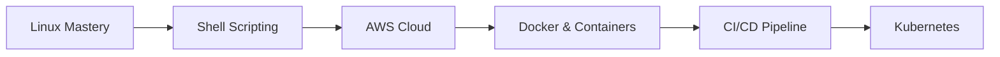

# 👋 Hello, I'm Rohit Raj | DevOps & Cloud Enthusiast

<div align="center">


**🎓 B.Tech CSE | ☁️ Cloud Computing | 🐧 Linux | 🚀 DevOps**

</div>

---

## 🎯 About Me

```javascript
const rohit = {
  education: "B.Tech in Computer Science & Engineering",
  specialization: "Cloud Computing",
  status: "Final Year Student",
  passion: ["Linux", "Automation", "DevOps", "Cloud Services"],
  motto: "Build Scalable, Efficient, and Real-World Solutions"
};
```

### 🏆 Recent Achievements
<div align="center">

| Achievement | Details | 
|------------|---------|
| 🥇 **Hackathon Winner** | 5th rank out of 2000+ participants |
| 🧠 **AI Project** | Built Legal Document Summarizer with AWS |
| 🎁 **Innovation Award** | $100 reward for innovative implementation |
| 📚 **Active Learner** | 1000+ hours of coding practice |

</div>

---

## 🛠️ Tech Stack

### 💻 Programming & Scripting
<div>
  
  
  
  
</div>

### ☁️ Cloud & DevOps
<div>
  
  
  
  
</div>

### 🗄️ Databases & Web
<div>
  
  
  
</div>

### 🔧 Tools & IDEs
<div>
  
  
  
</div>

---

## 📈 GitHub Analytics

<div align="center">

### 📊 GitHub Stats


### 💻 Most Used Languages


### 🏅 GitHub Trophies


</div>

---

## 🚀 Featured Projects

<details>
<summary><b>🤖 AI Legal Document Summarizer</b></summary>

```bash
# Tech Stack Used
- AWS Lambda
- Amazon S3
- Python
- NLP Libraries
- REST API
```

**Features:**
- 📄 Automated legal document processing
- 🤖 AI-powered summarization
- ☁️ Serverless architecture
- 🔐 Secure document handling

</details>

<details>
<summary><b>🐧 Linux Automation Scripts</b></summary>

```bash
# Automation Areas
- System Monitoring
- Backup Automation
- Deployment Scripts
- Resource Optimization
```

**Skills Demonstrated:**
- Bash scripting mastery
- Cron job scheduling
- System administration
- Process automation

</details>

<details>
<summary><b>☁️ Cloud Infrastructure Projects</b></summary>

```yaml
# AWS Services Used:
- EC2 Instances
- RDS Databases
- S3 Buckets
- IAM Roles
- VPC Configuration
```

**Achievements:**
- Cost-optimized infrastructure
- High-availability setups
- Security best practices
- Auto-scaling implementations

</details>

---

## 📚 Learning Journey

### 🎯 Current Focus Areas


### 📖 Recent Learning
- ✅ **Advanced Bash Scripting** - Automation & System Administration
- ✅ **AWS Fundamentals** - EC2, S3, RDS, Lambda
- ✅ **Git & GitHub** - Version Control Mastery
- 🔄 **Docker & Containerization** - In Progress
- 🔄 **CI/CD Pipelines** - Next Target

---

## 🎮 Interactive Section

<details>
<summary><b>💡 Try My Bash Skills!</b></summary>

```bash
# Sample System Info Script
#!/bin/bash
echo "=== System Information ==="
echo "User: $(whoami)"
echo "Hostname: $(hostname)"
echo "Uptime: $(uptime -p)"
echo "Memory: $(free -h | awk '/^Mem:/ {print $3"/"$2}')"
echo "Disk: $(df -h / | awk 'NR==2 {print $3"/"$2}')"
```

**Run this in your terminal to see system info!**

</details>

<details>
<summary><b>🧠 Quick Tech Quiz</b></summary>

1. **Which AWS service is serverless?**
   - A) EC2
   - B) Lambda ✅
   - C) RDS

2. **What does CI/CD stand for?**
   - A) Continuous Integration/Continuous Deployment ✅
   - B) Computer Interface/Computer Design
   - C) Cloud Infrastructure/Cloud Development

3. **Which is NOT a container technology?**
   - A) Docker
   - B) Kubernetes
   - C) VirtualBox ✅

</details>

---

## 📫 Connect With Me

<div align="center">

### 💼 Professional Networks
[](https://www.linkedin.com/in/rohit-raaj/)
[](https://github.com/Rohitt-Rajj)
[](https://leetcode.com/yourprofile)

### 📧 Contact
[](mailto:rohitsinghrajput62020@gmail.com)
[](https://yourportfolio.com)

### 🌐 Social
[](https://twitter.com/yourhandle)
[](https://dev.to/yourprofile)

</div>

---

## 📝 Latest Blog Posts / Updates

> **🚀 Learning Docker Containers**  
> *Currently exploring containerization and how it revolutionizes deployment.*  
> 📅 Updated: Today | 🔥 Status: In Progress

> **☁️ AWS Certification Journey**  
> *Preparing for AWS Cloud Practitioner certification.*  
> 📅 Updated: This Week | 📚 Resources: AWS Docs, Tutorials Dojo

> **🐧 Advanced Linux Scripting**  
> *Built automated backup system using Bash and Cron.*  
> 📅 Completed: Last Week | 💾 Code: Available on GitHub

---

## 🎯 Career Goals for 2024

- [x] Master Linux System Administration
- [x] Complete AWS Fundamentals
- [ ] Get AWS Cloud Practitioner Certified
- [ ] Build 5+ Real-World DevOps Projects
- [ ] Learn Kubernetes & Container Orchestration
- [ ] Contribute to Open Source Projects

---

<div align="center">

## 🏆 My Coding Philosophy

```bash
#!/bin/bash
echo "Code with purpose."
echo "Automate everything."
echo "Learn constantly."
echo "Build solutions."
echo "Share knowledge."
```

**"Transforming complex problems into elegant solutions, one script at a time."**

⭐ **Feel free to star my repositories if you find them helpful!** ⭐

---

### 📊 Monthly Activity


---

**Thanks for visiting! Let's build something amazing together.** 🚀

</div>

---

## 🔄 Real-Time Status

**Current Status:** 🟢 **Active & Learning**  
**Last Online:** 🕐 Just now  
**Next Project:** 🔧 **Dockerized Web Application**  
**Availability:** 📅 Open for collaborations & hackathons

---

<div align="center">
  
[](https://visitorbadge.io/status?path=https://github.com/Rohitt-Rajj)
  
</div>
