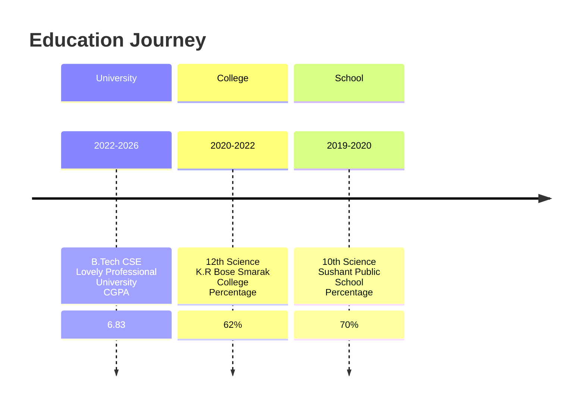
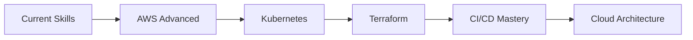

# 👋 Hello, I'm Rohit Raj | Cloud & DevOps Engineer

<div align="center">


**🎓 B.Tech CSE @ LPU | ☁️ AWS Certified | 🏆 Hackathon Winner | 🚀 DevOps Enthusiast**

</div>

---

## 🎯 About Me

```python
class RohitRaj:
    def __init__(self):
        self.education = "B.Tech Computer Science & Engineering"
        self.university = "Lovely Professional University (CGPA: 6.83)"
        self.specialization = "Cloud Computing & DevOps"
        self.status = "Final Year Student (2022-2026)"
        
    def skills(self):
        return {
            "languages": ["C", "C++", "Python", "JavaScript", "Bash"],
            "cloud": ["AWS (EC2, S3, IAM)", "Azure (Blob Storage, VMs)"],
            "devops": ["Git", "GitHub", "Linux", "Docker", "CI/CD"],
            "databases": ["MySQL", "Django"],
            "web": ["HTML5", "CSS3", "Flask", "Responsive Design"]
        }
    
    def motto(self):
        return "Building Scalable Cloud Solutions with DevOps Excellence"
```

### 🏆 Achievements & Certifications
<div align="center">

| 🏅 Achievement | 📅 Date | Details |
|--------------|---------|---------|
| **🥇 Top 05 Teams** | Jan 2025 | Prompt-Builder 2025 (AWS Competition) |
| **⭐ 3 Stars HackerRank** | Sep 2024 | C & C++ Problem Solving |
| **📜 IoT Certification** | May 2025 | NPTEL Internet of Things |
| **🤖 Gen AI Certified** | Jan 2025 | Google Introduction to Generative AI |
| **🚀 DevOps Certified** | Dec 2024 | LinkedIn Learning DevOps |

</div>

---

## 🛠️ Technical Stack

### 💻 Programming Languages
<div>
  
  
  
  
  
</div>

### ☁️ Cloud Technologies
<div>
  
  
  
  
</div>

### 🗄️ Databases & Backend
<div>
  
  
  
</div>

### 🌐 Web Development
<div>
  
  
  
  
</div>

---

## 🚀 Featured Projects

### ☁️ **Personal Cloud Storage Platform**
**Tech:** Python (Flask), Azure Blob Storage, HTML, CSS, JavaScript  
**Timeline:** September 2025  
```python
# Key Features:
- 🔒 Secure document transfer & organization
- ⚡ Flask-based REST APIs
- ☁️ Azure Blob Storage for elastic data handling
- 🌐 CORS-enabled cross-origin operations
- 🎯 Intuitive web interface with file visibility
```
**Impact:** Built protected web platform enabling streamlined document management with high-availability access.

### 🤖 **Linux-Based Robot Shell Controller**
**Tech:** Linux, Bash, Cron, File I/O, Logging  
**Timeline:** April 2025  
```bash
# Automation Features:
- 🎮 Terminal-driven robotic behavior simulation
- ⏰ Cron jobs for scheduled operations
- 📁 File-trigger sensor event simulation
- 📊 Structured activity logging system
- 🔄 Conditional workflow automation
```
**Impact:** Created automation system mimicking robotic behavior with scheduled and triggered operations.

### 💪 **Gym Website (Responsive Fitness Landing Page)**
**Tech:** HTML, CSS, JavaScript, Responsive Web Design  
**Timeline:** October 2024  
```javascript
// Interactive Features:
- 📱 Fully responsive design (Flexbox/Grid)
- 🧮 BMI evaluation calculator
- 💳 Package comparison tool
- 🎬 Animated page transitions
- ✅ Form validation & interactive components
```
**Impact:** Developed engaging fitness website with dynamic utilities and consistent cross-device experience.

---

## 📈 GitHub Analytics

<div align="center">

### 📊 GitHub Stats


### 💻 Most Used Languages


### 🏅 GitHub Trophies


</div>

---

## 🎓 Education Timeline



---

## 🏆 Skills Matrix

| Skill Category | Proficiency | Tools/Technologies |
|---------------|-------------|-------------------|
| **Programming** | ⭐⭐⭐⭐☆ | C, C++, Python, JavaScript |
| **Cloud Platforms** | ⭐⭐⭐☆☆ | AWS, Azure, Blob Storage |
| **DevOps Tools** | ⭐⭐⭐☆☆ | Git, GitHub, Linux, Bash |
| **Web Development** | ⭐⭐⭐⭐☆ | HTML, CSS, Flask, Responsive Design |
| **Databases** | ⭐⭐⭐☆☆ | MySQL, Django ORM |
| **Problem Solving** | ⭐⭐⭐⭐☆ | HackerRank 3★ (C/C++) |

---

## 📚 Certifications & Achievements

<div align="center">

### 🏅 Certifications
| Certification | Issuer | Date |
|--------------|--------|------|
| **Internet of Things** | NPTEL | May 2025 |
| **Introduction to Generative AI** | Google | Jan 2025 |
| **Getting Started with DevOps** | LinkedIn Learning | Dec 2024 |

### 🎯 Competition Achievements
| Competition | Achievement | Date |
|------------|-------------|------|
| **Prompt-Builder 2025** | Top 05 Teams (AWS Competition) | Jan 2025 |
| **HackerRank** | 3 Stars in C & C++ | Sep 2024 |

</div>

---

## 🎮 Interactive Portfolio

<details>
<summary><b>🚀 Try My Cloud Storage Demo</b></summary>

```python
# Simulated Flask API Endpoint
from flask import Flask, request, jsonify
import azure.storage.blob as azureblob

app = Flask(__name__)

@app.route('/upload', methods=['POST'])
def upload_file():
    """
    Simulated Azure Blob Storage Upload
    Similar to my Cloud Storage Platform project
    """
    file = request.files['file']
    # Azure upload logic would go here
    return jsonify({
        'status': 'success',
        'message': 'File uploaded to Azure Blob Storage',
        'filename': file.filename
    })
```

**Tech Stack Used in Actual Project:**
- Backend: Python Flask
- Storage: Azure Blob Storage
- Frontend: HTML, CSS, JavaScript
- Security: CORS, Authentication APIs

</details>

<details>
<summary><b>🤖 Linux Automation Script Sample</b></summary>

```bash
#!/bin/bash
# Sample from Robot Shell Controller Project
# Simulating robotic movement with logging

LOG_FILE="/var/log/robot_controller.log"
timestamp=$(date '+%Y-%m-%d %H:%M:%S')

function move_robot() {
    direction=$1
    echo "[$timestamp] MOVING: Robot moving $direction" >> $LOG_FILE
    # Actual movement logic would go here
    echo "Robot moved $direction successfully"
}

function check_sensor() {
    sensor_file="/tmp/sensor_trigger.txt"
    if [[ -f "$sensor_file" ]]; then
        echo "[$timestamp] SENSOR: Trigger detected!" >> $LOG_FILE
        # Trigger conditional workflow
        move_robot "forward"
        rm "$sensor_file"
    fi
}

# Cron would call this function periodically
check_sensor
```

</details>

<details>
<summary><b>🧠 Quick Tech Quiz</b></summary>

1. **Which cloud service did I use for blob storage?**
   - A) AWS S3
   - B) Azure Blob Storage ✅
   - C) Google Cloud Storage

2. **What framework powers my Cloud Storage backend?**
   - A) Django
   - B) Flask ✅
   - C) Node.js

3. **Which competition recognized me in top 5 teams?**
   - A) Google Code Jam
   - B) AWS Prompt-Builder 2025 ✅
   - C) Microsoft Imagine Cup

</details>

---

## 📫 Connect With Me

<div align="center">

### 💼 Professional Networks
[](https://www.linkedin.com/in/rohit-raaj/)
[](https://github.com/Rohitt-Rajj)
[](https://www.hackerrank.com/profile/yourprofile)

### 📧 Contact & Resume
[](mailto:rohitsinghrajput62020@gmail.com)
[](https://drive.google.com/file/d/your-cv-link)
[](https://yourportfolio.com)

### 🌐 Social Coding
[](https://leetcode.com/yourprofile)
[](https://gitlab.com/yourprofile)

</div>

---

## 🎯 Current Focus & Goals

### 🎓 **Academic Focus (2024-2026)**
- Complete B.Tech in Computer Science & Engineering
- Maintain specialization in Cloud Computing
- Graduate with strong project portfolio

### 💼 **Career Goals**
- Secure DevOps/Cloud Engineer role
- Master AWS & Azure certifications
- Contribute to open-source projects
- Build scalable infrastructure solutions

### 📚 **Learning Pipeline**


---

<div align="center">

## 🏆 My Development Philosophy

> **"Code with purpose, automate with precision, and scale with cloud-native principles."**

### 📊 Activity Overview


---

### 🌟 Visitor Counter
[](https://visitorbadge.io/status?path=https://github.com/Rohitt-Rajj)

---

**Open to collaborations, internships, and innovative projects!**  
**Let's build the future of cloud technology together.** ☁️🚀

⭐ **Star my repositories if you find them interesting!** ⭐

</div>

---

## 🔄 Real-Time Status

**Current Focus:** 🔧 **Cloud Architecture & DevOps**  
**Availability:** 📅 **Open for Summer 2025 Internships**  
**Next Certification:** 🏅 **AWS Solutions Architect**  
**Active Projects:** ☁️ **Multi-Cloud Deployment System**

---

<div align="center">
  
**Thanks for visiting my profile! Feel free to reach out for collaborations.** 🙌

</div>
